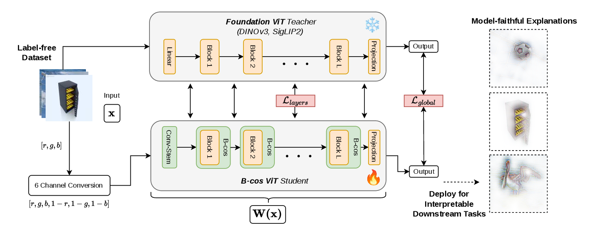
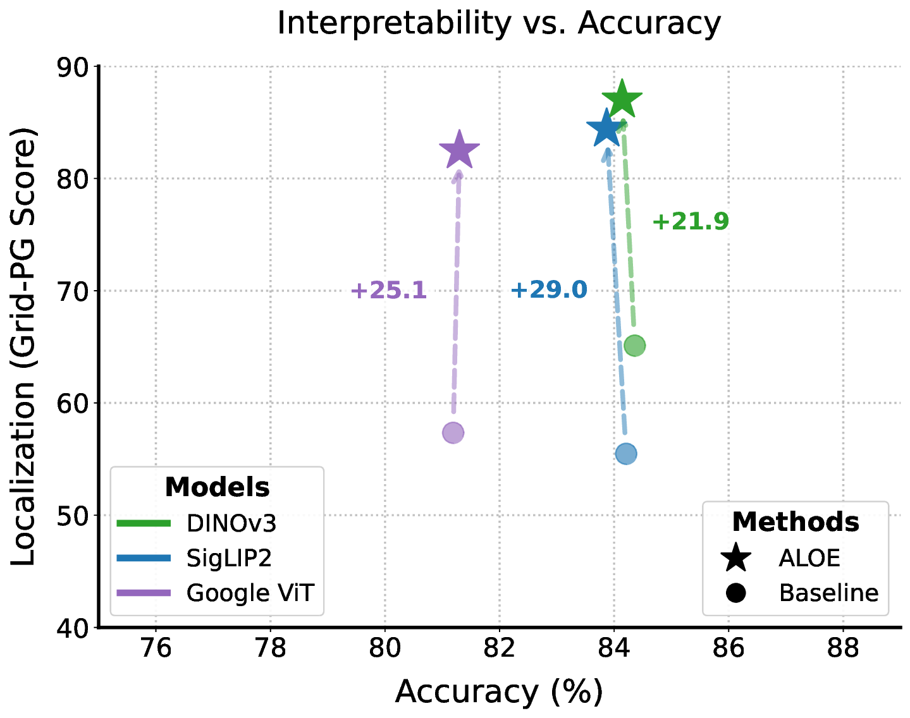
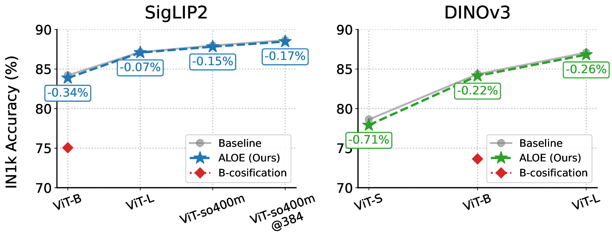
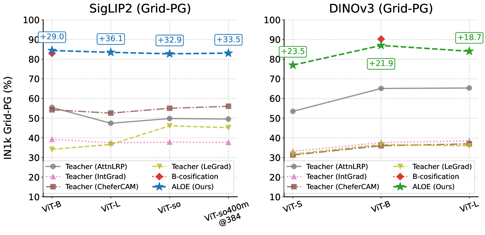
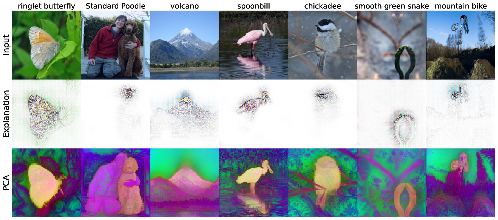
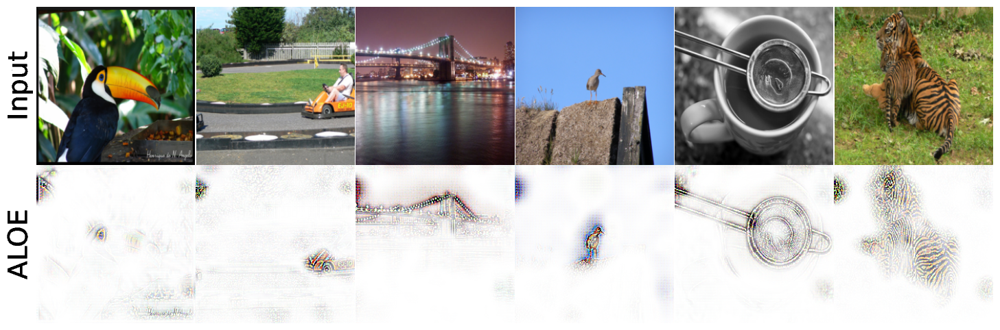
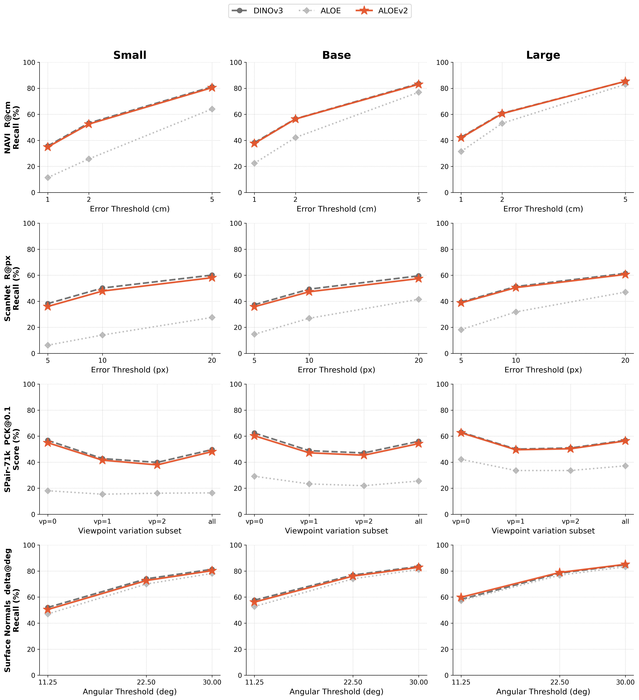
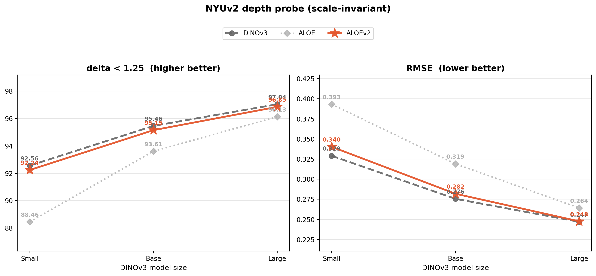
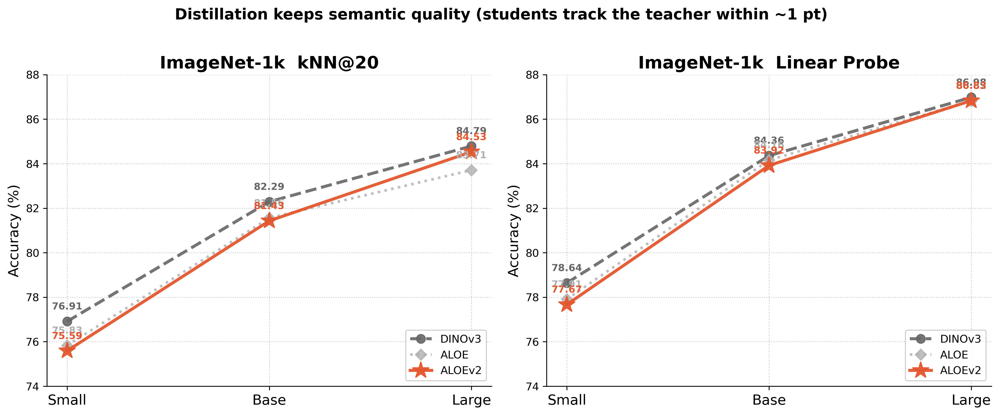
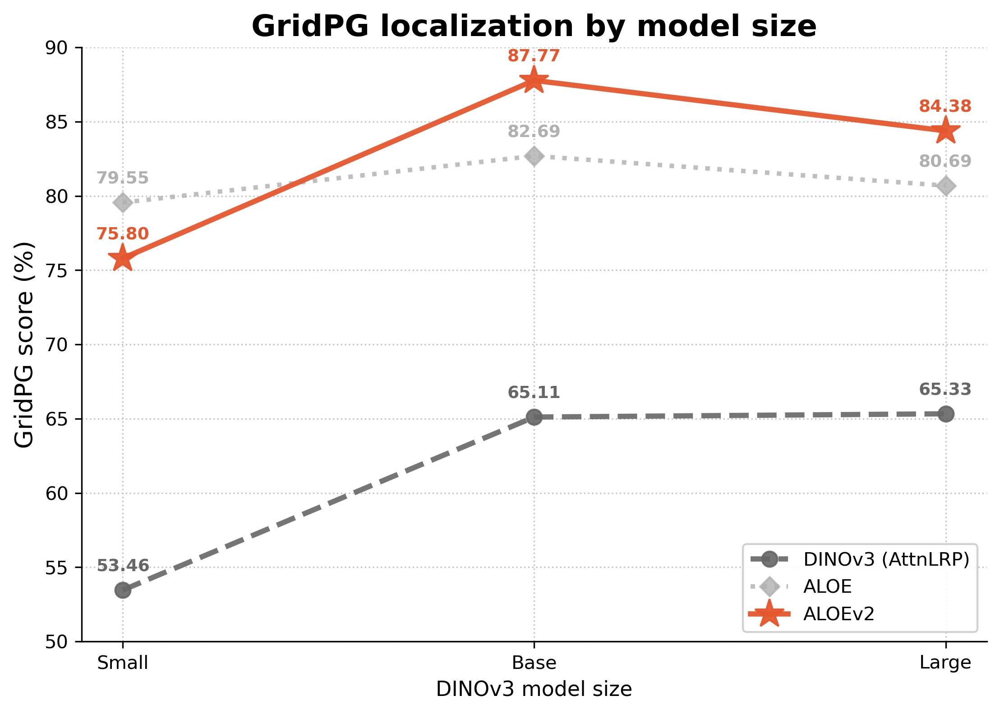

# ALOE: Align Once to Explain

This is the public code repository for **ALOE** (**AL**ign **O**nce to **E**xplain), our accepted CVPR 2026 poster **"Align Once to Explain: Feature Alignment for Scalable B-cosification of Foundational Vision Transformers"**.

ALOE converts strong ViT-style foundation models into inherently interpretable B-cos visual backbones through one-time, label-free feature alignment. The aligned backbone can then be used as a drop-in encoder for downstream evaluation while producing model-inherent B-cos explanations.

[](https://openaccess.thecvf.com/content/CVPR2026/html/Maser_Align_Once_to_Explain_Feature_Alignment_for_Scalable_B-cosification_of_CVPR_2026_paper.html)
[](https://rmaser.github.io/aloe_project/)
[](https://huggingface.co/collections/rmaser/aloe-69b285dfeee175d442f28232)
[](https://huggingface.co/collections/rmaser/aloev2-6a5ca2fceb4485f945461a5c)
[](LICENSE)

<p align="center">
  
</p>

**Transform to B-cos** — convert a foundation ViT encoder into a bias-free, dynamic-linear backbone. **Align once** — perform label-free feature alignment against the frozen teacher on unlabeled images. **Deploy** — freeze the aligned backbone for downstream transfer; explanations follow directly from the model's dynamic-linear summary.

## Highlights

- Label-free alignment from frozen supervised ViT, DINOv3, and SigLIP2 teachers.
- Public training and evaluation pipelines built with Hydra, Lightning, and Pixi.
- Published ALOE Hub checkpoints for DINOv3, SigLIP2, and supervised ViT families.
- Evaluation code for linear probing, k-NN, zero-shot transfer, GridPG, and pixel deletion.
- Explanation methods including B-cos, AttnLRP, integrated gradients, LeGrad, CheferCAM, LIME, and other Captum-based baselines.

## Main Results

All values below are from the paper and are reported on ImageNet-1k. Linear probe and k-NN measure recognition quality. GridPG measures localization quality; teacher GridPG uses the strongest reported teacher-side post-hoc baseline in the table, AttnLRP, while ALOE uses model-inherent B-cos attributions.

<p align="center">
  
</p>

| Model family | Architecture | Teacher LP | ALOE LP | Teacher k-NN | ALOE k-NN | Teacher GridPG | ALOE GridPG |
| --- | --- | ---: | ---: | ---: | ---: | ---: | ---: |
| supervised ViT | ViT-B/16 | 81.16 | 81.12 | 80.72 | 80.77 | 55.80 | 82.45 |
| DINOv3 | ViT-S/16 | 78.64 | 77.72 | 76.91 | 75.70 | 52.86 | 79.55 |
| DINOv3 | ViT-B/16 | 84.36 | 84.04 | 82.27 | 81.39 | 62.02 | 82.69 |
| DINOv3 | ViT-L/16 | 86.92 | 86.64 | 84.73 | 84.35 | 64.66 | 80.69 |
| SigLIP2 | ViT-B/16 | 84.20 | 83.80 | 80.40 | 80.17 | 54.43 | 81.04 |
| SigLIP2 | ViT-L/16 | 87.20 | 87.08 | 83.78 | 83.92 | 47.95 | 78.20 |
| SigLIP2 | ViT-so400m/16 | 87.89 | 87.76 | 84.51 | 84.62 | 48.84 | 77.77 |
| SigLIP2 | ViT-so400m/16 at 432 px | 88.62 | 88.36 | 85.06 | 85.17 | 49.04 | 79.19 |

Across 10-dataset ViT-B/16 frozen-feature linear evaluation, ALOE improves over vanilla B-cosification by +13.24 points for supervised ViT, +7.62 points for SigLIP2, and +15.82 points for DINOv3 while staying close to the original teacher models.

### Performance Across Model Scale

<p align="center">
  
</p>

<p align="center">
  
</p>

### Explanations and Feature Geometry

<p align="center">
  
</p>

The model-inherent attributions are object-centric and class-specific. The PCA visualizations show that alignment preserves the teacher's spatially structured feature geometry while making its evidence directly inspectable.

### Zero-Shot Explanations

<p align="center">
  
</p>

ALOE publishes vision encoders only. Pair a SigLIP2-family checkpoint with the original SigLIP2 text encoder named in its config, then pass normalized text features to `explain_language_features` to explain image-text cosine similarity:

```python
import torch
import torch.nn.functional as F
from PIL import Image
from transformers import AutoImageProcessor, AutoModel, AutoTokenizer, Siglip2TextModel

repo_id = "rmaser/aloe-siglip2-base"
device = torch.device("cuda" if torch.cuda.is_available() else "cpu")

processor = AutoImageProcessor.from_pretrained(repo_id, trust_remote_code=True)
image_model = AutoModel.from_pretrained(repo_id, trust_remote_code=True).to(device)
image_model.eval()

text_model_id = image_model.config.aloe_base_model_name
tokenizer = AutoTokenizer.from_pretrained(text_model_id)
text_model = Siglip2TextModel.from_pretrained(text_model_id).to(device)
text_model.eval()

labels = ["a person eating spaghetti", "a person playing guitar", "a person running"]
prompts = [f"This is a photo of {label}.".lower() for label in labels]
tokens = tokenizer(
    prompts,
    padding="max_length",
    truncation=True,
    max_length=64,
    return_tensors="pt",
).to(device)

with torch.no_grad():
    text_features = F.normalize(text_model(**tokens).pooler_output, dim=-1)

image = Image.open("image.jpg").convert("RGB")
pixel_values = processor(images=image, return_tensors="pt").pixel_values.to(device)

explanation = image_model.explain_language_features(
    pixel_values,
    text_features,
    idx=None,
)
# explanation["explanation"]         — RGBA attribution overlay, (1, H, W, 4)
# explanation["contribution_map"]    — input×gradient map, (1, 1, H, W)
# explanation["explained_class_idx"] — index into labels
```

`idx=None` explains the highest-scoring label; pass a label index to explain a specific prompt. Explanation calls currently expect one input image at a time.

### ALOEv2

ALOEv2 is the multi-resolution DINOv3 follow-up. It fine-tunes the ALOE DINOv3 models with per-step 224/384/480-pixel sampling and corrects the selected distillation depths to include the final transformer block. This removes the train/evaluation resolution mismatch that hurt the original models on dense prediction while preserving classification quality and inherent B-cos explanations.

<p align="center">
  
</p>

<p align="center">
  
</p>

Multi-resolution alignment restores dense-feature quality close to the DINOv3 teacher across correspondence, surface normals, and monocular depth.

<p align="center">
  
</p>

<p align="center">
  
</p>

## Published Models

The public ALOE model set contains eight backbones:

| Hub repo | Teacher family | Architecture |
| --- | --- | --- |
| `rmaser/aloe-dinov3-small` | DINOv3 | ViT-S/16 |
| `rmaser/aloe-dinov3-base` | DINOv3 | ViT-B/16 |
| `rmaser/aloe-dinov3-large` | DINOv3 | ViT-L/16 |
| `rmaser/aloe-vit-base` | supervised ViT | ViT-B/16 |
| `rmaser/aloe-siglip2-base` | SigLIP2 | ViT-B/16 |
| `rmaser/aloe-siglip2-large` | SigLIP2 | ViT-L/16 |
| `rmaser/aloe-siglip2-so400m` | SigLIP2 | ViT-so400m/16 |
| `rmaser/aloe-siglip2-so400m-432` | SigLIP2 | ViT-so400m/16 at 432 px |

Seven ALOE checkpoints include their trained ImageNet-1k linear-probe classifier:

| Hub repo | Teacher family | Architecture |
| --- | --- | --- |
| `rmaser/aloe-dinov3-small-in1k-lp` | DINOv3 | ViT-S/16 |
| `rmaser/aloe-dinov3-base-in1k-lp` | DINOv3 | ViT-B/16 |
| `rmaser/aloe-dinov3-large-in1k-lp` | DINOv3 | ViT-L/16 |
| `rmaser/aloe-siglip2-base-in1k-lp` | SigLIP2 | ViT-B/16 |
| `rmaser/aloe-siglip2-large-in1k-lp` | SigLIP2 | ViT-L/16 |
| `rmaser/aloe-siglip2-so400m-in1k-lp` | SigLIP2 | ViT-so400m/16 |
| `rmaser/aloe-siglip2-so400m-432-in1k-lp` | SigLIP2 | ViT-so400m/16 at 432 px |

ALOEv2 provides matching DINOv3 backbones and ImageNet-1k classifiers:

| Backbone | ImageNet-1k classifier |
| --- | --- |
| `rmaser/aloe-v2-dinov3-small` | `rmaser/aloe-v2-dinov3-small-in1k-lp` |
| `rmaser/aloe-v2-dinov3-base` | `rmaser/aloe-v2-dinov3-base-in1k-lp` |
| `rmaser/aloe-v2-dinov3-large` | `rmaser/aloe-v2-dinov3-large-in1k-lp` |

## Loading ALOE Models

Published ALOE checkpoints use custom Hugging Face `transformers` code, so load them with `trust_remote_code=True`.

```python
from transformers import AutoImageProcessor, AutoModel

repo_id = "rmaser/aloe-dinov3-base"
processor = AutoImageProcessor.from_pretrained(repo_id, trust_remote_code=True)
model = AutoModel.from_pretrained(repo_id, trust_remote_code=True)
model.eval()
```

Load a checkpoint with its ImageNet-1k classifier through the classification auto class:

```python
from transformers import AutoImageProcessor, AutoModelForImageClassification

repo_id = "rmaser/aloe-dinov3-base-in1k-lp"
processor = AutoImageProcessor.from_pretrained(repo_id, trust_remote_code=True)
model = AutoModelForImageClassification.from_pretrained(
    repo_id,
    trust_remote_code=True,
)
model.eval()
```

### Minimal Class Explanations

Classifier checkpoints expose model-inherent explanations directly through `model.explain(...)`:

```python
from PIL import Image
from transformers import AutoImageProcessor, AutoModelForImageClassification

repo_id = "rmaser/aloe-dinov3-base-in1k-lp"
processor = AutoImageProcessor.from_pretrained(repo_id, trust_remote_code=True)
model = AutoModelForImageClassification.from_pretrained(
    repo_id,
    trust_remote_code=True,
)
model.eval()

image = Image.open("image.jpg").convert("RGB")
pixel_values = processor(images=image, return_tensors="pt").pixel_values

result = model.explain(pixel_values, idx=None)
class_idx = int(result["explained_class_idx"][0])
print(f"Predicted ImageNet-1k class index: {class_idx}")

rgba = (result["explanation"][0] * 255).astype("uint8")
Image.fromarray(rgba).save("explanation.png")
```

`idx=None` explains the predicted class. Pass an ImageNet-1k class index to `idx` to explain a specific class instead.

For code that needs this repository's Hydra/model-factory path, use `aloe_model_loader.py`. It is intentionally thin and delegates to `src.models.model_loader`.

## Repository Layout

| Path | Purpose |
| --- | --- |
| `scripts/train.py` | Hydra entry point for ALOE alignment/distillation training. |
| `scripts/eval.py` | Hydra entry point for representation and explanation evaluation. |
| `scripts/config.py` | Shared script setup helpers. |
| `aloe_model_loader.py` | Bridge module for external integrations that need this repo's model loader. |
| `src/models/` | ModelFactory, model configs, HF/native loading helpers, and model utilities. |
| `src/modules/` | B-cos layers, attention, activations, norms, pooling, and classifier heads. |
| `src/training/` | Lightning module, losses, schedulers, callbacks, and training utilities. |
| `src/eval/` | Linear probe, k-NN, zero-shot, GridPG, and pixel-deletion evaluators. |
| `src/explanation/` | B-cos explanations and post-hoc explanation baselines. |
| `src/explainability/grid_score/` | Grid Pointing Game metric implementation. |
| `configs/` | Hydra configuration tree for models, data, training, evaluation, and launchers. |

## Environment

This repository uses Pixi and is configured for Linux CUDA environments.

```bash
export SCRATCH=/path/to/scratch
pixi install
```

`SCRATCH` is required. Pixi resolves project paths from it:

| Variable | Derived path |
| --- | --- |
| `CACHE_PATH` | `${SCRATCH}/ALOE/.cache` |
| `DATA_PATH` | `${SCRATCH}/data/huggingface/datasets` |
| `HF_HUB_CACHE` | `${SCRATCH}/data/huggingface/hub` |
| `HF_DATASETS_CACHE` | `${SCRATCH}/data/huggingface/datasets` |

## Training

Public training tasks are defined in `pixi.toml` and launch Hydra multiruns through `scripts/train.py`.

```bash
pixi run train_native_distill_siglip2_base
pixi run train_native_distill_siglip2_large
pixi run train_native_distill_siglip2_so400m
pixi run train_native_distill_siglip2_so400m_432

pixi run train_native_distill_dinov3_small
pixi run train_native_distill_dinov3_base
pixi run train_native_distill_dinov3_large

pixi run train_native_distill_google_vit_base
```

The training configs live under `configs/experiment/native/`. They freeze the teacher, train an ALOE B-cos student, and align global and token-level features with the objectives and model factories defined under `configs/objective/`, `configs/loss/`, `configs/model/factory/`, and `src/training/`.

## Evaluation

Run linear probing and k-NN over the published Hub checkpoints:

```bash
pixi run eval_native_hf_all_hub_lp
```

Run classifier/explanation evaluation over published ALOE classifiers:

```bash
pixi run eval_native_classifier
pixi run eval_native_classifier_distilled_supervised
```

Run baseline HF backbone evaluation:

```bash
pixi run eval_hf_baseline
```

The public Hub evaluation sweep covers the eight published ALOE backbones and the main classification datasets used in the paper: ImageNet-1k, Caltech101, Stanford Cars, CIFAR-10, CIFAR-100, DTD, Oxford Flowers102, Food101, SUN397, and FGVC Aircraft.

## Configuration

Important config groups:

| Config group | Examples |
| --- | --- |
| `configs/model/backbone/dinov3/` | DINOv3 teachers and ALOE DINOv3 students. |
| `configs/model/backbone/siglip2/` | SigLIP2 teachers and ALOE SigLIP2 students. |
| `configs/model/backbone/google_vit/` | supervised ViT teacher and ALOE ViT student. |
| `configs/model/supervised/` | ImageNet-1k linear-probe classifier configs. |
| `configs/evaluator/` | `linear_probe`, `knn`, `zero_shot`, `grid_pg`, `pixel_deletion`. |
| `configs/explainer/` | B-cos and post-hoc explanation methods. |
| `configs/hydra/` | Submitit launcher presets. |

## License

This project is licensed under the [Creative Commons Attribution-NonCommercial ShareAlike 4.0 International License](LICENSE). The methods described in this repository are patent pending.

## Citation

```bibtex
@inproceedings{maser2026align,
  title = {Align Once to Explain: Feature Alignment for Scalable B-cosification of Foundational Vision Transformers},
  author = {Maser, Raphael and Gairola, Siddhartha and Rao, Sukrut and Schiele, Bernt},
  booktitle = {Proceedings of the IEEE/CVF Conference on Computer Vision and Pattern Recognition (CVPR)},
  year = {2026},
  note = {Poster}
}
```
